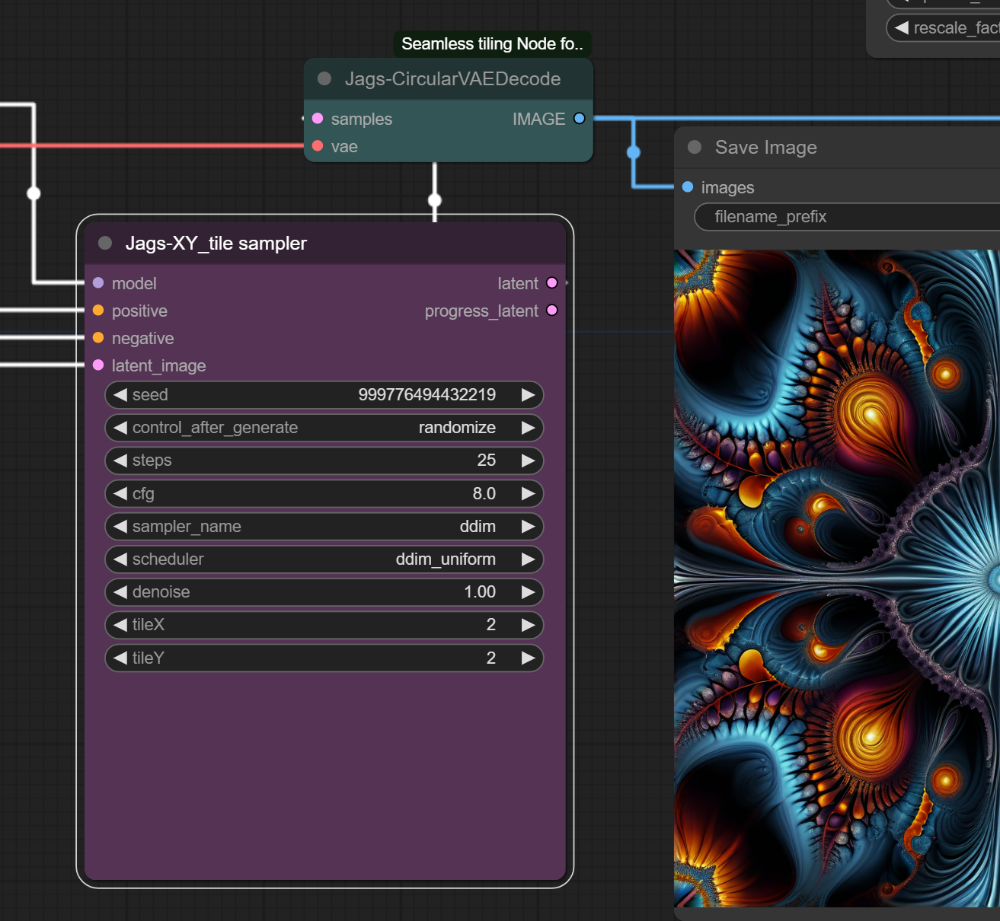
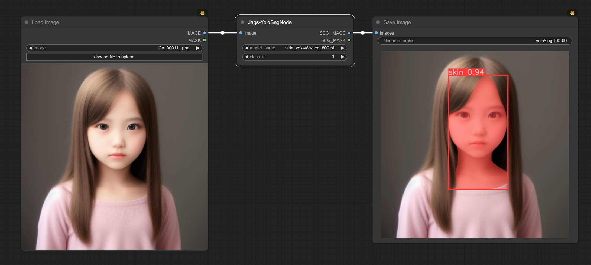
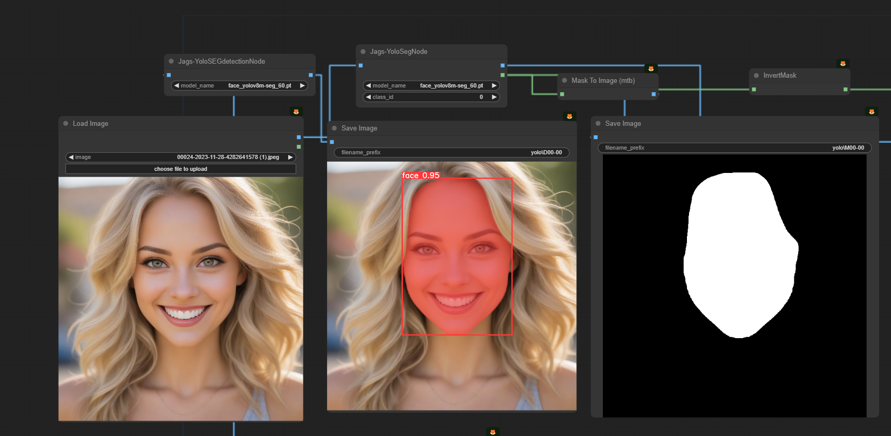
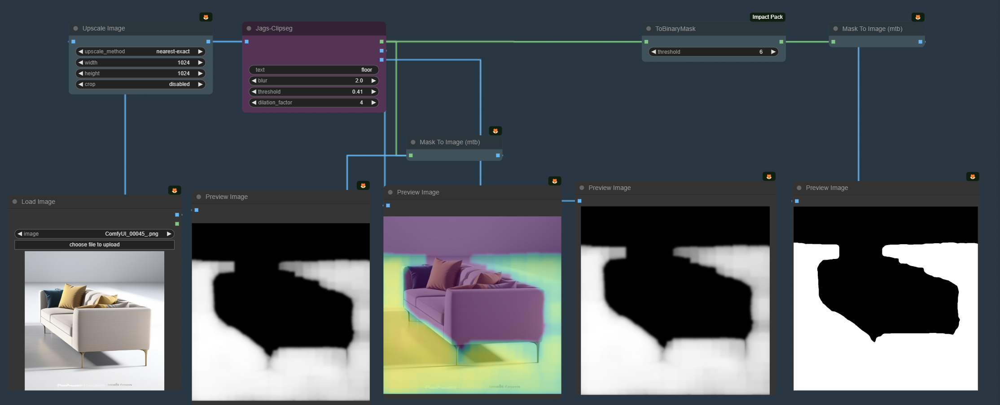
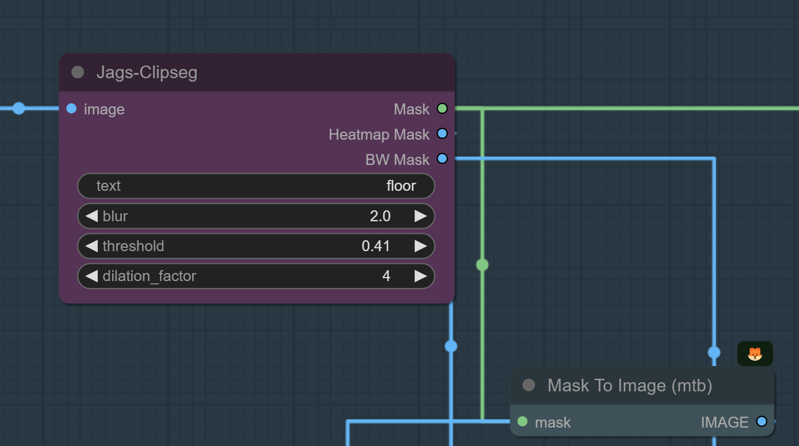
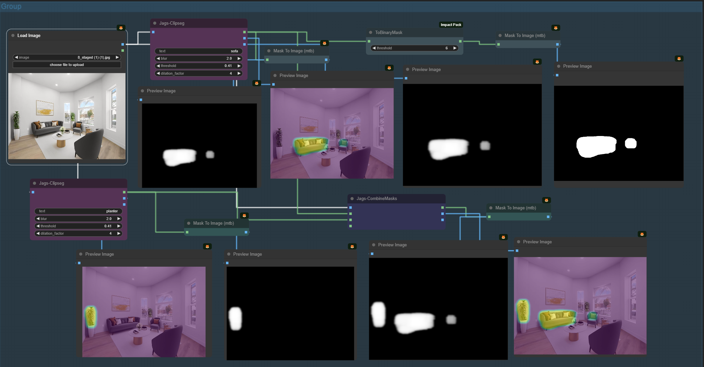
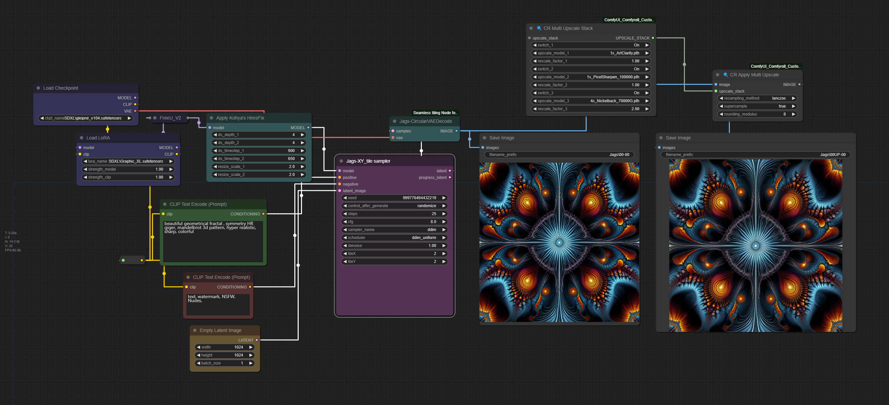
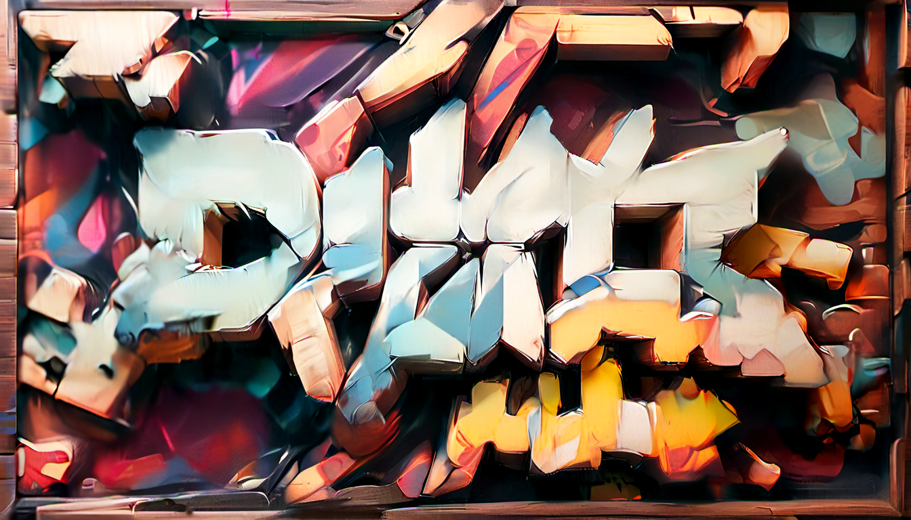

# ComfyUI_Jags_VectorMagic
#a collection of nodes to explore Vector and image manipulation

✨🍬Please note the work in this repo is not completed and still in progress and code will break until all things are sorted. Please wait as will announce same in the update here.
Thanks for your support. Also note for any issues on the nodes, kindly share your workflow and alos always update comfyUI base including all dependencies.✨🍬

### Nodes
# x-y tiling K sampler and circular VAE modes for tileable images

# Segmentation using Ultralytics Yolov8 models and creating masks with same
  

  

You can see more examples of the workflow and proper selection of models for each type of segmentation masks in the <a href = "https://github.com/jags111/ComfyUI_Jags_VectorMagic/wiki">*VECTOR MAGIC WIKI* </a> 

# Jags-Clipseg Nodes
CLIPSeg adds a minimal decoder on top of a frozen CLIP model for zero- and one-shot image segmentation.
The CLIPSeg node generates a binary mask for a given input image and text prompt.
   
   

**Inputs:**

- image: A torch.Tensor representing the input image.
- text: A string representing the text prompt.
- blur: A float value to control the amount of Gaussian blur applied to the mask.
- threshold: A float value to control the threshold for creating the binary mask.
- dilation_factor: A float value to control the dilation of the binary mask.

**Outputs:**

- tensor_bw: A torch.Tensor representing the binary mask.
- image_out_hm: A torch.Tensor representing the heatmap overlay on the input image.
- image_out_bw: A torch.Tensor representing the binary mask overlay on the input image. 

### JagsCombineSegMasks

The CombineSegMasks node combines two or optionally three masks into a single mask to improve masking of different areas. 

   

**Inputs:**

- image: A torch.Tensor representing the input image.
- mask1: A torch.Tensor representing the first mask.
- mask2: A torch.Tensor representing the second mask.
- mask3 (optional): A torch.Tensor representing the third mask. Defaults to None.

**Outputs:**

- combined_mask: A torch.Tensor representing the combined mask.
- image_out_hm: A torch.Tensor representing the heatmap overlay of the combined mask on the input image.
- image_out_bw: A torch.Tensor representing the binary mask overlay of the combined mask on the input image.

### Example Work flow
# x-y tiling K sampler and circular VAE modes for tileable images- workflow using SDXL
 

### ComfyUI_Jags_VectorMagic- WIKI

Link to the workflow and explanations : <a href= "https://github.com/jags111/ComfyUI_Jags_VectorMagic/wiki"> **WIKI** </a>

### Dependencies
The python library <i><a href="https://github.com/danthedeckie/simpleeval" >simpleeval</a></i> is required to be installed if you wish to use the **expression Nodes**.
<pre>pip install simpleeval</pre>
Also can be installed with a simple pip command  
'pip install simpleeval'

A single file library for easily adding evaluatable expressions into python projects. Say you want to allow a user to set an alarm volume, which could depend on the time of day, alarm level, how many previous alarms had gone off, and if there is music playing at the time.

check Notes for more information.

## **Install:**
To install, drop the "_**ComfyUI_Jags_VectorMagic**_" folder into the "_**...\ComfyUI\custom_nodes**_" directory and restart UI. 
Ensure all the requirements.txt dependencies are met. 
But the best method is to install same from ComfyUI Manager (https://github.com/ltdrdata/ComfyUI-Manager) and search for this name in the Node list and install from there and restart the UI as it takes care of all the dependencies and installs and make it easy for you. 

Put all Seg models in comfyUI/models/Yolov8 
DOwnload Yolov8 seg detector and other collections from the following resources; 

*Ultralytics Detection models :* <a href = "https://docs.ultralytics.com/tasks/detect/"> *YOLOv8n* </a> 

*Ultralytics Segmentation models :* <a href = "https://docs.ultralytics.com/tasks/segment/">  *YOLOv8n-seg,*   </a>  

*Ultralytics Pose models :* Also available incase you want to explore : <a href = "(https://docs.ultralytics.com/tasks/pose/)"> POSE MODELS (yolov8n-pose.pt yolov8s-pose.pt yolov8m-pose.pt yolov8l-pose.pt yolov8x-pose.pt yolov8x-pose-p6.pt) </a> Please note teh pose modesl need a seperate type of node to work and cannot be deployed in normal segmentaion mask node.  

* Face detection models - download from this git repo <a href = "https://github.com/akanametov/yolov8-face" >  Face segmentation models </a>  

**Installing Clipseg models**  
ComfyUI node for  the <a href = "https://huggingface.co/docs/transformers/main/en/model_doc/clipseg" > [CLIPSeg model] </a> to generate masks for image inpainting tasks based on text prompts. 
Download  <a href = "https://huggingface.co/CIDAS/clipseg-rd64-refined/tree/main"> *clipseg model* </a> and place it in [comfy\models\clipseg] directory for the node to work

## Todo

[ ] Add guidance to notebook

# Comfy Resources

**ComfyUI_Jags_VectorMagic Linked Repos**
- [BlenderNeko ComfyUI_ADV_CLIP_emb](https://github.com/BlenderNeko/ComfyUI_ADV_CLIP_emb)  by@BlenderNeko
- [Chrisgoringe cg-noise](https://github.com/chrisgoringe/cg-noise)  by@Chrisgoringe
- [pythongosssss ComfyUI-Custom-Scripts](https://github.com/pythongosssss/ComfyUI-Custom-Scripts)  by@pythongosssss
- [shiimizu ComfyUI_smZNodes](https://github.com/shiimizu/ComfyUI_smZNodes)  by@shiimizu
- [LEv145_images-grid-comfyUI-plugin](https://github.com/LEv145/images-grid-comfy-plugin))  by@LEv145
- [ltdrdata-ComfyUI-Inspire-Pack](https://github.com/ltdrdata/ComfyUI-Inspire-Pack) by@ltdrdata
- [pythongosssss-ComfyUI-custom-Scripts](https://github.com/pythongosssss/ComfyUI-Custom-Scripts) by@pythongosssss
- [RockOfFire-ComfyUI_Comfyroll_CustomNodes](https://github.com/RockOfFire/ComfyUI_Comfyroll_CustomNodes) by@RockOfFire
- [biegert-ComfyUI-CLIPSeg](https://github.com/biegert/ComfyUI-CLIPSeg) by@biegert 

**Guides**:
- [Official Examples (eng)](https://comfyanonymous.github.io/ComfyUI_examples/)- 
- [ComfyUI Community Manual (eng)](https://blenderneko.github.io/ComfyUI-docs/) by @BlenderNeko

- **Extensions and Custom Nodes**:  
- [Plugins for Comfy List (eng)](https://github.com/WASasquatch/comfyui-plugins) by @WASasquatch
- [ComfyUI tag on CivitAI (eng)](https://civitai.com/tag/comfyui)-   
- [Tomoaki's personal Wiki (jap)](https://comfyui.creamlab.net/guides/) by @tjhayasaka

  ## Support
If you create a cool image with our nodes, please show your result and message us on twitter at @jags111 or @NeuralismAI .

You can join the <a href="https://discord.gg/vNVqT82W" alt="Neuralism Discord"> NEURALISM AI DISCORD </a> or <a href="https://discord.gg/UmSd4qyh" alt =Jags AI Discord > JAGS AI DISCORD </a> 
Share your work created with this model. Exchange experiences and parameters. And see more interesting custom workflows.

Support us in Patreon for more future models and new versions of AI notebooks.
- tip me on <a href="https://www.patreon.com/jags111"> [patreon]</a>

 My buymeacoffee.com pages and links are here and if you feel you are happy with my work just buy me a coffee !

 <a href="https://www.buymeacoffee.com/jagsAI"> coffee for JAGS AI</a> 

Thank you for being awesome!

<!-- end support-pitch -->

